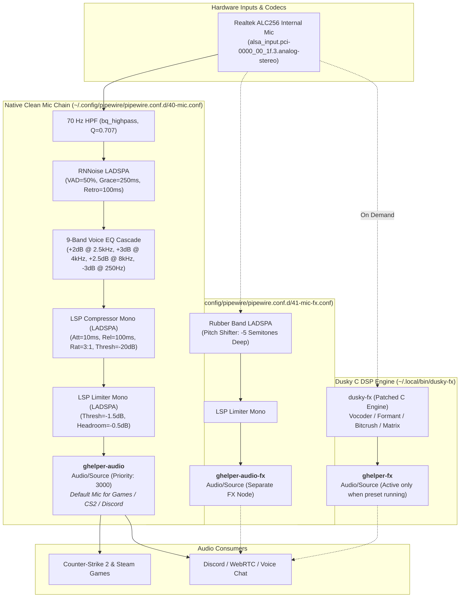

# CachyOS Unified Audio Stack — Architecture & Operational Guide

## 1. Architecture Overview & Signal Flow

The audio stack merges native PipeWire filter chains for zero-overhead, always-available microphone processing with an on-demand C DSP engine for character voice effects. No background daemons idle in RAM.

### Signal Flow Diagram



---

## 2. File Layout

| Path | Purpose | Management |
| :--- | :--- | :--- |
| `~/.config/pipewire/pipewire.conf.d/40-mic.conf` | Native clean mic filter-chain (`ghelper-audio`) | chezmoi |
| `~/.config/pipewire/pipewire.conf.d/41-mic-fx.conf` | Static pitch FX filter-chain (`ghelper-audio-fx`) | chezmoi |
| `~/.local/bin/mic` | One-shot CLI tool (`clean`, `fx`, `voice`, `gate`, `status`) | chezmoi |
| `~/.local/bin/rofi-mic` | Interactive Rofi menu for voice FX switching | chezmoi |
| `~/.local/bin/dusky-fx` | Patched Dusky C DSP binary (compiled with mold, march=native, LTO) | local binary |
| `~/docs/audio/dusky-fx-node-rename.patch` | Node name patch (`ghelper-audio` -> `ghelper-fx`) | documentation |
| `~/docs/audio/dusky-import-audit.md` | Full audit report of Dusky DSP code and system plugins | documentation |
| `~/docs/audio/rollback.sh` | One-command rollback script | documentation |
| `~/.config/pipewire/backup/` | Pre-implementation timestamped backups | local backup |

---

## 3. CLI Commands & Controls

The microphone stack is controlled by `mic` (one-shot, bash):

```bash
# Set clean mic as default source (ensures any FX engine is killed)
mic clean

# Set static pitch-shifted mic as default source
mic fx

# Start on-demand C engine with character preset and set as default source
mic voice "Darth Vader"
mic voice "Daft Punk"
mic voice "Cylon Robot"
mic voice "Megatron"
mic voice "Chipmunk"
mic voice "Kraftwerk"
mic voice "Matrix Agent"
mic voice "Robot Phone"
mic voice "Sci-Fi Alien"
mic voice "T-Pain"
mic voice "Stephen Hawking"

# Stop on-demand voice FX and restore clean mic
mic voice off

# Set gate aggressiveness (when FX engine is running)
mic gate 60

# Inspect microphone stack status, active node IDs, and running engine
mic status
```

An interactive launcher is available via `rofi-mic` (or bound to a hotkey).

---

## 4. What Was Kept vs Dropped

### Kept (Retained & Optimized)
- **RNNoise Neural Suppression:** Cleaned with 50% VAD threshold, 250ms grace, 100ms retroactive buffer.
- **70 Hz High-Pass Filter:** Eliminates desk rumbles, laptop chassis vibrations, and fan low-end.
- **9-Band Acoustic Vocal EQ:** Adapted Dusky curve to boost intelligibility (+2.5dB at 2.5kHz–8kHz, -3dB rumble cut at 250Hz).
- **Pro Dynamic Control:** LSP mono compressor and hard limiter to prevent game-callout shouting distortion.
- **Character Voice Presets:** Vocoder, robot, formant synthesis, bitcrusher, and matrix FX kept via the compiled C binary on demand.
- **CS2 Target Consistency:** Fixed node name `ghelper-audio` (Priority: 3000) guarantees CS2 and Steam never break their default recording target.

### Dropped (Eliminated Bloat)
- **Always-Running Python/GTK GUI Daemon:** Dusky GUI and 200ms Python polling loops eliminated.
- **Always-Running Background DSP Engine:** `dusky-audio-dsp.service` disabled; zero idle CPU when not using voice FX.
- **Side-Tone / Live Loopback Audio:** Removed constant microphone monitoring to speakers/headphones to eliminate feedback loops and latency.
- **Live GUI Telemetry Sockets:** Removed continuous pipe communication for audio meters when unneeded.
- **`PartOf=pipewire` Hack:** Removed rogue systemd unit dependencies that caused cascaded audio restart failures.

---

## 5. Rollback Procedures

To restore the previous setup at any time:

```bash
~/docs/audio/rollback.sh
```

Or manually:
```bash
mic voice off
rm -f ~/.config/pipewire/pipewire.conf.d/40-mic.conf
rm -f ~/.config/pipewire/pipewire.conf.d/41-mic-fx.conf
systemctl --user restart pipewire pipewire-pulse wireplumber
systemctl --user enable --now dusky-audio-dsp.service
```
